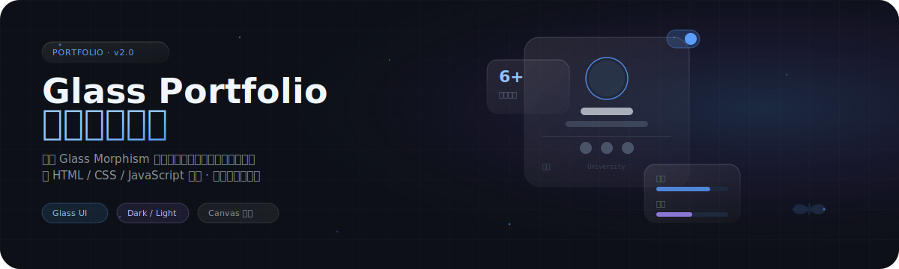

<p align="center">
  
</p>

<p align="center">
  
  
  
  
  
  
</p>

<br>

> 采用 **Glass Morphism（毛玻璃）** 设计语言的现代化个人作品集网站。纯 HTML / CSS / JavaScript 构建，零构建工具依赖，支持深浅双主题一键切换，内置 Canvas 动态背景与丰富的交互动效。

<br>

## 项目预览

<p align="center">
  
</p>

<details>
<summary>点击展开更多页面预览</summary>
<br>

| 首页 | 作品 |
|:---:|:---:|
|  |  |

| 简历 | 生活 |
|:---:|:---:|
|  |  |

</details>

<br>


<br>

### 玻璃态设计（Glass Morphism）

全站组件统一采用毛玻璃效果，核心三要素：

- **半透明背景**：深色 `rgba(22, 27, 34, 0.55)` / 浅色 `rgba(255, 255, 255, 0.60)`
- **背景模糊**：`backdrop-filter: blur(16px)` 营造磨砂玻璃质感
- **高光边框**：`1px solid rgba(255, 255, 255, 0.10)` 模拟玻璃边缘反光

配合科技感网格背景与径向渐变光晕，让毛玻璃效果更有层次感。

### 双主题系统

- **深色主题**：`#5b9eff`（Azure Blue 蔚蓝）主色 + 深灰背景
- **浅色主题**：`#1e40af`（Sapphire Blue 宝蓝）主色 + 浅灰背景
- 一键切换，所有组件（卡片、导航、按钮、Canvas 动画）实时响应主题变化

### Canvas 动态背景

基于 Paper.js 的 Canvas 动画系统：

- **星空粒子**：随鼠标移动反向洒落的星星粒子
- **三角形漂浮**：缓慢移动与旋转的几何图形
- **花瓣飘落**：柔和的花瓣旋转下落效果
- **鼠标火花**：光标周围生成的星星状光粒

<br>


<br>

| 页面 | 文件 | 说明 |
|:---|:---|:---|
| **首页** | `index.html` | 主入口，含 Hero 视频、个人介绍、技能展示、项目经历 |
| **作品** | `home.html` | 项目作品集展示，图片卡片网格布局 |
| **简历** | `resume.html` | 个人简历，技能进度条 + 教育经历时间线 |
| **博客** | `blog.html` | 技术文章列表与分类 |
| **生活** | `live.html` | 生活照片墙，旅行 / 美食 / 运动 |
| **联系** | `contact.html` | 联系表单与社交链接 |

<br>


<br>

### 前端技术

| 技术 | 用途 |
|:---|:---|
| **HTML5** | 页面结构与语义化标签 |
| **CSS3** | 样式与动画（Flexbox 布局、过渡效果、Backdrop Filter） |
| **原生 JavaScript** | 交互逻辑与主题切换 |
| **jQuery** | DOM 操作与事件处理 |

### 动画与特效库

| 库 | 用途 |
|:---|:---|
| **Paper.js** | Canvas 矢量图形动画（星空、三角形、花瓣） |
| **Prism.js** | 代码语法高亮 |
| **Marked.js** | Markdown 解析与渲染 |
| **QRCode.js** | 二维码生成 |

### 设计系统

- **色彩**：Azure / Sapphire 双调蓝主色，玻璃态半透明填充
- **字体**：Noto Sans SC（中文）+ JetBrains Mono（代码）
- **间距**：8px 基数的间距令牌系统
- **动效**：统一的 0.3s cubic-bezier 过渡曲线

<br>

---

## 快速开始

### 方式一：直接打开

直接在浏览器中打开 `index.html` 即可预览。

### 方式二：本地服务器（推荐）

```bash
# 使用 Python 启动本地服务器
python -m http.server 8080

# 或使用 Node.js
npx serve .
```

然后访问 `http://localhost:8080` 即可查看。

> **提示**：建议使用现代浏览器（Chrome / Firefox / Edge / Safari）以获得最佳毛玻璃效果体验。

<br>

## 项目结构

```
portfolio-frontend/
├── index.html              # 主入口
├── home.html               # 作品页
├── blog.html               # 博客页
├── resume.html             # 简历页
├── live.html               # 生活页
├── contact.html            # 联系页
├── css/                    # 样式文件
│   ├── base.css            # 基础样式 & 设计令牌
│   ├── index.css           # 首页样式
│   ├── home.css            # 作品页样式
│   └── ...                 # 其他页面样式
├── js/                     # 脚本文件
│   ├── base.js             # 基础脚本 & 主题切换
│   ├── canvas.js           # Canvas 动画
│   └── ...                 # 其他脚本
├── img/                    # 图片与媒体资源
├── assets/readme/          # README 视觉资产
└── README.md
```

<br>

## 致敬与来源声明

本项目基于 [@wttAndroid/web-resume-resume](https://github.com/wttAndroid/web-resume-resume)（木兰宽松许可证 MulanPSL-2.0）进行二次开发与修改。

在此向原作者表示衷心感谢：

- **原始项目**：[wttAndroid/web-resume-resume](https://github.com/wttAndroid/web-resume-resume)
- **原作者**：[@wttAndroid](https://github.com/wttAndroid)
- **原始许可证**：MulanPSL-2.0

本项目在原项目基础上进行了以下修改：
- 重构设计系统，全面采用 Glass Morphism 玻璃态设计语言
- 修复并完善深色/浅色双主题切换功能
- 升级色彩系统为 Azure/Sapphire 双调蓝
- 优化背景为科技感网格与径向渐变
- 替换个人信息为占位符，清除隐私数据
- 调整页面布局与交互逻辑

原始的 Canvas 星空动画、蝴蝶加载动画、花瓣特效等核心视觉设计均来自原项目。

<br>

## 许可证

本项目基于 [wttAndroid/web-resume-resume](https://github.com/wttAndroid/web-resume-resume)（MulanPSL-2.0）二次开发，遵循**木兰宽松许可证第 2 版**。

- 原始许可证：MulanPSL-2.0
- 本修改版本同样遵循 MulanPSL-2.0 许可证

<br>

---

<p align="center">
  <sub>Glass Morphism Portfolio · Made with pure HTML / CSS / JS</sub>
</p>
